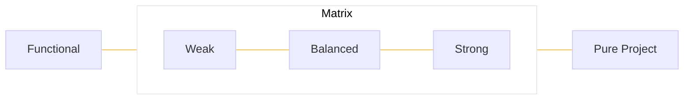
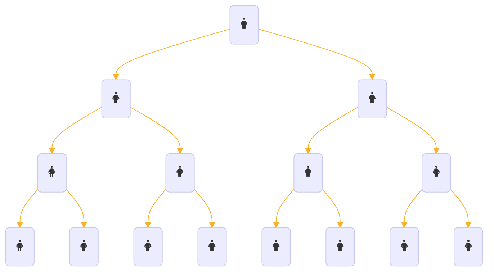
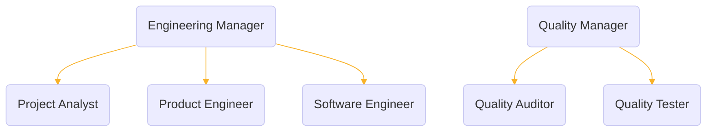
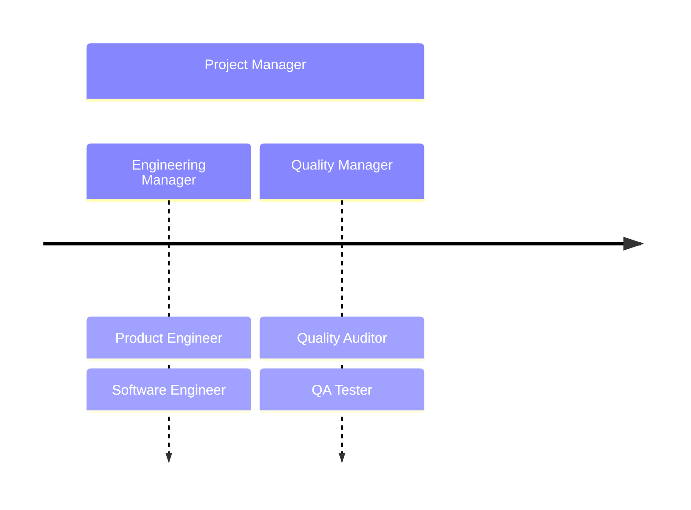

## Project Structures Within Organizations

Projects operate within organizations and as such, not all project structures are the same. Just as organizations have different structures, so do projects. Businesses and corporations are organized in various ways. Sometimes this is structured with a traditional organization-functional, hierarchical, or vertical. In this type of structure there are functional heads or department heads that manage a specific function in the organization (finance, engineering, manufacturing, purchasing). Organizations can also be organized by strategic business units (product line or customer base), geographic location (North American region, African region, etc.), type of customer (consumer, commercial, governmental, educational, etc.), or some combination of the above.

Usually, we find three different types of project structures within organizations in which Projects and Project Managers must operate. They are Functional, Matrix, and Pure Project. Functional organizations are also called Traditional, Hierarchical, or Vertical organizations.

### Functional (Traditional, Hierarchical or Vertical) Organization

Most military organizations are organized using a traditional organization. In a structure such as shown below, the function or

the hierarchical leader has primary control, responsibility, and authority over that function or department within that organization and there is a clear vertical chain of command. Functional units are primarily responsible for maintaining the business operations related to that function. A project manager that operates a project that stays within the boundaries of the function will typically report to a functional leader and get resources from within that same functional team. An example of this would be an accounting project that only involves the resources and scope from the accounting department. Most projects, however, work across functional groups. For example, a project for new product development; it would involve sales, marketing, engineering, manufacturing, finance, etc. In this case, the project manager must work across the functional hierarchy to obtain the resources and support.

The project manager in the functional structure is typically the functional manager that has the majority of the resources to deliver the project, or there is a project analyst or coordinator assigned to work across the functions. There are typically part-time resources in such a structure that share their time between operations work and project work.

The project analyst is 100% allocated to the project, but the software engineer and quality assurance tester are only allocated 50% to the project. And the product engineer and quality assurance auditor are only allocated 25% to the project. Each person reports to their functional manager. The benefits of this structure is that it is fairly simple and provides easy access to the resources needed to perform the work on the project. The disadvantages of working in the structure for delivery of a project is that the more functions involved, the more difficult it is to coordinate across the functions, as well as finding the right priority of work so that the project work gets the attention needed and resources are not distracted with operational work. These structures are good when projects are mostly contained within one functional area. One of the important things to remember is that if you are a project analyst or coordinator in a functional organization structure, you will have little to no authority in making project decisions or managing the project budget and resources. The resources, budget, and authority are controlled by the functional managers. As a project analyst or coordinator in the functional organization structure, you will have to use many different types of soft skills and networking to get the resources you may require for your project to be successful. And you will always be competing against operational priorities supported by the same resources.

### Pure Project Organization

The pure project, or projectized organization, is a structure where every activity is treated as a project and every activity is conducted by a project team. Pure project organizations are a complete opposite from the traditional hierarchical functional structure. If you are a project manager in a pure project organizational structure, you have full authority. In pure project organizations, the project manager will control the resources and budget. Project work is organized by project instead of by functional unit.

In this illustration, you see that all the resource boxes are shaded, meaning all the resources on the project are full-time. They are dedicated to the project, and they report directly to the project manager instead of a functional manager. Their boss is the project manager and all they work on are the project deliverables. This structure is particularly suitable for long-term multiyear projects that require dedicated effort to deliver a complex product or service that needs focused effort to complete. In this structure, the project manager has full authority. It is a simple structure and there is significant team comradery created, as the whole team is dedicated and focused on achieving the project goals and objectives.

There are some disadvantages in this structure, however. Since the resources are dedicated to this project, that means they can't be made available to other projects that might also need that skill set. So each project team would need to have their own tester or their own engineer as opposed to sharing resources across multiple projects. In addition, since projects are temporary, they have a start and an end. At the end of the project, all the resources on the project must find other project work to move to. This can be a very stressful time for the team and does consume a large amount of the project manager's time in helping their team find other positions within the organization.

### Matrix Organization

<b>A Typical Matrix Organization Structure</b>

The matrix organization tries to take advantages of some aspects from both the pure project and functional organizational structures. The matrix organization will have traditional, functional units,and projects will draw team members from across the functions.There are various levels of matrix organizations. A weak matrix organization takes on more characteristics of a functional organizational structure. A strong matrix organization will resemble more of a pure project organizational structure.In the matrix structure you see elements from both the functional structure and pure project structure.

There is typically a full-time project manager that reports to either a program manager or,perhaps, a higher-level functional manager.They have some full-time resources, shown above as fully-shaded resource boxes, such as the project manager, product engineer, and software engineer.
They also have some part-time resources that work for them on the project, such as the quality assurance auditor, and quality assurance tester. Notice, however, the solid line reporting structure for the functional resources, such as the engineers, still report to their boss, the engineering manager. They also report along the line to the project manager, meaning, they have functional responsibility to their boss, the engineering manager, and they also report to the project manager for project-related activities.So, a key characteristic of a matrix structure is that resources have two bosses: their functional manager and their project manager.

If the project manager is given more control over such things as the budget and resources, then the matrix is considered strong. If the functional managers maintain control over the budget and resources, the matrix is considered weak. A balance matrix has more of an equally-shared responsibility between the functional and project manager. The matrix structure has become very common in organizations as it provides the greatest flexibility to organizations in the use of their resources. This structure can be used for both short or long-term projects, and projects that require coordination across multiple functional areas. As you may guess, this structure pulls in the advantages of both the functional and pure project structures. The advantages of such a structure is that it allows for greater sharing of resources across projects, while still maintaining a project focus and shared responsibility for project success. However, this structure also comes with its disadvantages as well. Most employees don't favor having more than one boss. It can create work conflicts and stressful situations if this is not well coordinated.

## What Structure Works Best?

You will notice that none of the structures we have looked at are perfect - they each have advantages and disadvantages. The key is to match the right structure to the needs, goals, and objectives of the project. The organization should consider such elements such as:

- The length of the project: unless the project is contained to a single functional unit, long term projects are best served with a strong matrix or pure project structure.
- How many functional areas need to be engaged: the more functional areas that need to be engaged, the more advantageous the matrix or pure project structure will be.
- The dedicated (full time) project resources needed (including if a dedicated Project Manager is needed): dedicated (full time) project resources are best served in a strong matrix or pure project structure.
- The complexity of the project: the more complex a project, the more flexibility is needed in the structure, so a matrix or pure project structure would be best.
- The technical or functional depth of the project: for technically deep and functionally specific projects, the functional or weak matrix would be best.

In larger organizations, it is very common to see elements of all 3 organizational structures for projects. The structures are adjusted for each project to meet the needs of that project. When a Project Manager initiates a project, one element they should determine quickly is the type of structure they believe will best fit the needs of the project. In this way, they can work with management and the Project Sponsor to ensure the correct structure is utilized so as not to create an undue burden on the Project Manager to deliver the project.
